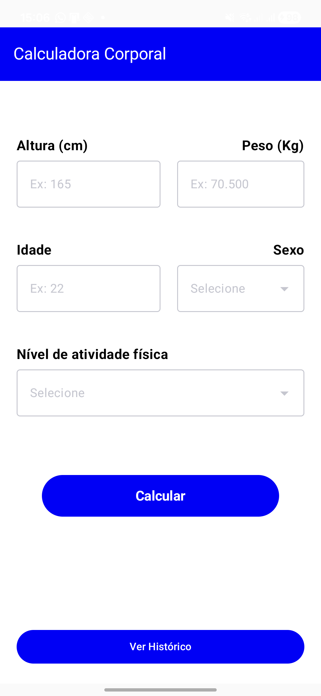
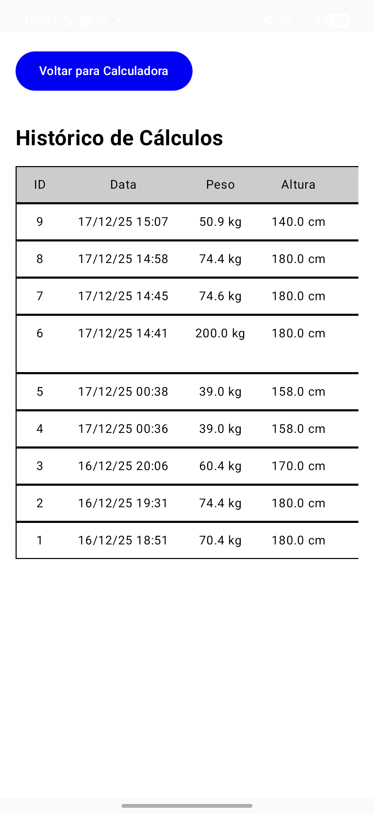

# Calculadora Corporal - Android

Este projeto é uma aplicação de saúde desenvolvida para Android que permite calcular métricas corporais essenciais e manter um registro persistente da evolução do usuário.

---

## 📸 Demonstração da Interface

Abaixo estão as capturas de tela que exemplificam o fluxo de uso, desde a entrada de dados até a visualização detalhada do histórico:

| 1. Calculadora (Home) | 2. Resultado Rápido | 3. Histórico de Cálculos | 4. Detalhes Completos |
| :---: | :---: | :---: | :---: |
|  |  |  |  |
| Interface para inserção de dados biométricos. | Resultado imediato exibido logo após o cálculo. | Tabela com todos os registros salvos no Room. | Relatório detalhado com glossário e diagnóstico. |

---

## 🚀 Funcionalidades

* **Cálculo Multimétrico:** Processa IMC, Taxa Metabólica Basal (TMB), Peso Ideal e Calorias Diárias com base em altura, peso, idade, sexo e nível de atividade.
* **Classificação Automática:** Identifica a categoria do IMC (como "Peso normal" ou "Sobrepeso") seguindo padrões de saúde estabelecidos.
* **Persistência de Dados:** Salva automaticamente cada cálculo no banco de dados local através do Room.
* **Histórico Detalhado:** Lista cronológica de todos os cálculos anteriores organizada em uma visualização tabular.
* **Detalhamento de Resultados:** Permite visualizar o diagnóstico completo e o glossário explicativo de cada registro salvo no histórico.

---

## 📱 Telas da Aplicação

1. **Home (Calculadora):** Interface de entrada com campos validados para peso, altura e idade, utilizando menus suspensos (*ExposedDropdownMenuBox*) para sexo e nível de atividade.
2. **Histórico:** Exibição em tabela com rolagem horizontal que organiza dados como IMC, TMB, Peso Ideal e Calorias.
3. **Detalhes:** Apresenta o relatório textual detalhado gerado pelo sistema para um cálculo específico selecionado.

---

## 🏗️ Arquitetura e Decisões Técnicas

O projeto segue o padrão **MVVM (Model-View-ViewModel)** com separação clara de responsabilidades:

### Camadas e Componentes
* **Domain (UseCase):** Centraliza as fórmulas matemáticas e regras de negócio de forma independente da interface.
* **Data (Room):** Gerencia a persistência local em SQLite através de `CalcEntity`, `CalcDao` e `CalcDatabase`.
* **View (Compose):** Interface reativa e moderna construída integralmente com Jetpack Compose.
* **ViewModel:** Gerencia o estado da UI e a comunicação assíncrona com o banco de dados via *Coroutines* e *StateFlow*.

### Decisões Técnicas
* **Reatividade:** O banco de dados retorna um `Flow`, permitindo que a lista de histórico seja atualizada na interface em tempo real sempre que um novo cálculo é salvo.
* **Segurança de Threads:** Operações de escrita no banco de dados são executadas dentro do `viewModelScope` para não bloquear a thread principal.
* **Singleton:** O acesso ao banco de dados é feito através de uma instância única protegida por `@Volatile` e bloqueio sincronizado.

---

## 🛠️ Como Executar

1. Clone este repositório.
2. Abra o projeto no **Android Studio**.
3. Sincronize o Gradle para baixar as dependências (Compose, Room, etc.).
4. Execute em um dispositivo ou emulador com nível de API compatível.

---

## ✍️ Autor

Desenvolvido por **Lucas Soares**.

---